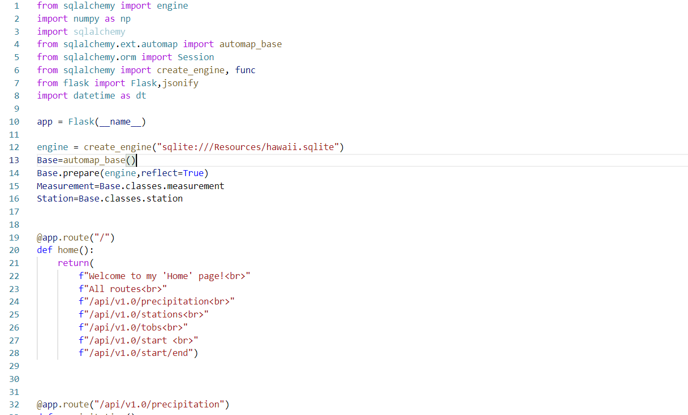

# SQLalchemy-Climate-Analysis-

To help with a long holiday vacation in Honolulu-Hawaii planning, I need to do some climate analysis on the area. The following outlines what you I did.

Step 1 - Climate Analysis and Exploration
To begin, use Python and SQLAlchemy to do basic climate analysis and data exploration of my climate database. All of the following analysis should be completed using SQLAlchemy ORM queries, Pandas, and Matplotlib.

Use the provided starter notebook and hawaii.sqlite files to complete your climate analysis and data exploration.

Use SQLAlchemy create_engine to connect to your sqlite database.

Use SQLAlchemy automap_base() to reflect your tables into classes and save a reference to those classes called Station and Measurement.

Link Python to the database by creating an SQLAlchemy session.

-Precipitation Analysis

Start by finding the most recent date in the data set.

Using this date, retrieve the last 12 months of precipitation data by querying the 12 preceding months of data. Note you do not pass in the date as a variable to your query.

Select only the date and prcp values.

Load the query results into a Pandas DataFrame and set the index to the date column.

Sort the DataFrame values by date.

Plot the results using the DataFrame plot method.

-Station Analysis

Design a query to calculate the total number of stations in the dataset.

Design a query to find the most active stations (i.e. which stations have the most rows?).

Design a query to retrieve the last 12 months of temperature observation data (TOBS).

Step 2 - Climate App
Afte the initial analysis being completed, design a Flask API based on the queries. 

Use Flask to create your routes.

Routes /Home page.

/api/v1.0/precipitation

/api/v1.0/stations

/api/v1.0/tobs

/api/v1.0/<start> and /api/v1.0/<start>/<end>

There are some screenshots of my work:

